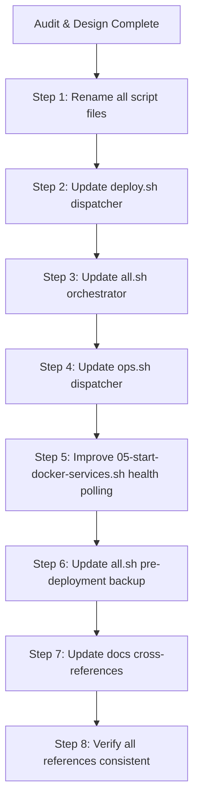

# Deployment Scripts — Production Safety Audit & Renaming

## Status

VPN (Marzban) and Vaultwarden are already in production with real data.
3 SQLite databases contain production data and must never be touched directly.

---

## Per-Script Analysis

### 1. [`00-check-env.sh`](scripts/deploy/00-check-env.sh) → `00-check-environment.sh`

**Operation**: Read-only validation (env vars, Docker, DNS, ports).

| Check | Result |
|-------|--------|
| Destructive actions? | ❌ None. Only validation. |
| Affects SQLite? | ❌ No. |
| Existing file handling | N/A — no files written. |
| **Production safe?** | **✅ Yes** |

**Concerns**: None. Pure validation step.

---

### 2. [`01-init-dirs.sh`](scripts/deploy/01-init-dirs.sh) → `01-init-data-directories.sh`

**Operation**: `mkdir -p` + `cp` nginx.conf + snippets + `chmod`.

| Check | Result |
|-------|--------|
| Destructive actions? | `mkdir -p` is safe (no-op if exists). `cp` overwrites nginx.conf and snippets — expected behavior (repo is source of truth). |
| Affects SQLite? | ❌ No. Only nginx configs + directory structure. |
| Existing file handling | `mkdir -p` ignores existing dirs ✅. `cp` always overwrites nginx.conf and snippets — this is **design intent** (repo configs must propagate). |
| **Production safe?** | **✅ Yes** — but `cp` silently overwrites config files. |

**Caution**: If someone manually edited a snippet in `DATA_DIR/nginx/snippets/`, the edit would be overwritten by the repo version. This is correct behavior (git is source of truth), but worth documenting.

---

### 3. [`02-generate-reality.sh`](scripts/deploy/02-generate-reality.sh) → `02-generate-reality-keys.sh`

**Operation**: Generate x25519 keypair → `DATA_DIR/private/reality.json`.

| Check | Result |
|-------|--------|
| Destructive actions? | **Already skips** if `reality.json` exists (`exit 0`). ✅ |
| Affects SQLite? | ❌ No. |
| Existing file handling | **Idempotent** — exit 0 if file exists. User must explicitly `rm` to regenerate. |
| **Production safe?** | **✅ Yes** |

**Note**: Regenerating REALITY keys would invalidate all existing client configs. The skip-on-exist behavior is correct production safety.

---

### 4. [`03-issue-certs.sh`](scripts/deploy/03-issue-certs.sh) → `03-issue-tls-certificates.sh`

**Operation**: Issue/renew LE certificates for all domains.

| Check | Result |
|-------|--------|
| Destructive actions? | Complex logic but well-guarded: CERT-001 through CERT-006 safety gates. Reuses existing valid certs (>30d remaining). Refuses in-place replacement of bad certs (forces staged upgrade path). ❌ Never deletes good certs. |
| Affects SQLite? | ❌ No. |
| Existing file handling | **CERT-001**: Skips if cert valid >30d. **CERT-003**: Refuses in-place overwrite of non-trusted certs unless `CERTBOT_REPLACE_UNTRUSTED=true`. **CERT-004**: Refuses in-place replacement of malformed live directory. |
| **Production safe?** | **✅ Yes** — well-guarded against accidental replacement. |

---

### 5. [`04-render-configs.py`](scripts/deploy/04-render-configs.py) → `04-render-configuration-templates.py`

**Operation**: Render all templates → DATA_DIR. Delete stale vhost `.conf` files.

| Check | Result |
|-------|--------|
| Destructive actions? | **YES — stale vhost deletion**: removes `.conf` files in `DATA_DIR/nginx/conf.d/` that have no matching template. This is the **riskiest operation** in the pipeline. |
| Affects SQLite? | ❌ No. Only nginx/Xray/Marzban templates. |
| Existing file handling | `render_file()` always overwrites output. `copy_file()` always overwrites. Stale vhost deletion compares rendered `.conf` names against template `.conf.template` names — if a template is renamed, old `.conf` is deleted. |
| **Production safe?** | **⚠️ Yes for data, but risky for nginx config**. The stale deletion is the only concern. |

**Risk scenario**: 
- Template `05-console.conf.template` is temporarily removed during a git conflict
- `04-render-configs.py` runs → deletes the rendered `05-console.conf`
- `nginx -t` catches this in deploy.sh step, but if `--skip-verify` is used, console goes offline

**Mitigation**: `deploy.sh config` step already runs `nginx -t` before reload. This prevents deploying broken config. ✅

---

### 6. [`05-up.sh`](scripts/deploy/05-up.sh) → `05-start-docker-services.sh`

**Operation**: `docker compose up -d --build` + restart Python services + nginx reload.

| Check | Result |
|-------|--------|
| Destructive actions? | ❌ None. `docker compose up -d` preserves all volumes (bind mounts to DATA_DIR). SQLite files on host are untouched. |
| Affects SQLite? | ❌ No — Docker bind mounts persist across compose operations. |
| Existing file handling | Volumes are bind mounts to `${DATA_DIR}` on the host. Always preserved. ✅ |
| **Production safe?** | **✅ Yes** |

**Concerns**:
- `--build` triggers Next.js Docker build every time (slow, ~2-3 min)
- `sleep 15` is a hard wait instead of health check polling
- Name `05-up.sh` sounds like "upgrade" which is misleading

---

### 7. [`06-verify.sh`](scripts/deploy/06-verify.sh) → `06-verify-deployment.sh`

**Operation**: Read-only verification (containers, HTTPS, ports, DBs, cron).

| Check | Result |
|-------|--------|
| Destructive actions? | ❌ None. All checks are read-only (curl, docker inspect, openssl s_client). |
| Affects SQLite? | ❌ No. Only checks if files exist (`du -sh` is read-only). |
| Existing file handling | N/A — no files written. |
| **Production safe?** | **✅ Yes** |

---

### 8. [`post.sh`](scripts/deploy/post.sh) → `07-post-deploy-wizard.sh`

**Operation**: Interactive wizard — creates Marzban users, configures hosts, saves subscription URLs.

| Check | Result |
|-------|--------|
| Destructive actions? | Creates users via Marzban API (idempotent — skips existing users). Configures inbound hosts (PUT /api/hosts — idempotent). ✅ |
| Affects SQLite? | Indirectly through Marzban API. Writes to Marzban's `db.sqlite3` via the API (adding users). This is **intentional** behavior. |
| Existing file handling | User creation checks `GET /api/user/{username}` first — skips if user exists. |
| **Production safe?** | **✅ Yes** — idempotent user creation. |

---

## Production Safety Summary

| Script | Data Safe? | SQLite Safe? | Idempotent? | Risk Level |
|--------|-----------|-------------|-------------|------------|
| 00-check-environment | ✅ | ✅ | ✅ | None |
| 01-init-data-directories | ⚠️ overwrites nginx configs | ✅ | ✅ | Low |
| 02-generate-reality-keys | ✅ skips if exists | ✅ | ✅ | None |
| 03-issue-tls-certificates | ✅ guarded by CERT-* gates | ✅ | ✅ | Low |
| 04-render-configuration-templates | ⚠️ stale vhost deletion | ✅ | ✅ | Low |
| 05-start-docker-services | ✅ volumes preserved | ✅ | ✅ | Low |
| 06-verify-deployment | ✅ read-only | ✅ | ✅ | None |
| 07-post-deploy-wizard | ✅ idempotent API calls | ✅ | ✅ | Low |

**Three SQLite databases and their safety**:
| Database | Path | Protected by |
|----------|------|-------------|
| Marzban | `${DATA_DIR}/marzban/db.sqlite3` | Docker bind mount (never mounted as volume in scripts) |
| Account | `${DATA_DIR}/account/account.db` | Only written by `umbra-account` Python service |
| Vaultwarden | `${DATA_DIR}/vaultwarden/data/db.sqlite3` | Only written by `umbra-vaultwarden` service |

No script directly deletes or overwrites any SQLite file.

---

## Naming Changes

### Script Files

| Current | Proposed | Rationale |
|---------|----------|-----------|
| `00-check-env.sh` | `00-check-environment.sh` | Full word avoids abbreviation confusion |
| `01-init-dirs.sh` | `01-init-data-directories.sh` | Clarifies what directories (DATA_DIR, not system dirs) |
| `02-generate-reality.sh` | `02-generate-reality-keys.sh` | Clarifies it generates keys, not services |
| `03-issue-certs.sh` | `03-issue-tls-certificates.sh` | Full name prevents "certs" → "certain" confusion |
| `04-render-configs.py` | `04-render-configuration-templates.py` | Clarifies it renders templates, not arbitrary files |
| `05-up.sh` | `05-start-docker-services.sh` | **Critical**: "up" sounds like upgrade/update — new name clarifies it starts containers |
| `06-verify.sh` | `06-verify-deployment.sh` | Clarifies scope is full deployment verification |
| `post.sh` | `07-post-deploy-wizard.sh` | Adds numeric prefix for order clarity, full name for purpose |
| `all.sh` | Keep as-is | Internal orchestrator, not user-facing |

### Deploy Dispatcher Commands

| Current | Change? | Rationale |
|---------|---------|-----------|
| `bash scripts/deploy.sh all` | ✅ Keep | Already clear |
| `bash scripts/deploy.sh check` | → `environment` | "check" too vague; matches new script name |
| `bash scripts/deploy.sh dirs` | → `directories` | Full word |
| `bash scripts/deploy.sh keys` | → `reality-keys` | Prevent confusion with SSH/other keys |
| `bash scripts/deploy.sh certs` | → `certificates` | Full word prevents ambiguity |
| `bash scripts/deploy.sh config` | ✅ Keep | Already clear (render configs) |
| `bash scripts/deploy.sh up` | → `start` | **"up" sounds like upgrade** — "start" clearly means start services |
| `bash scripts/deploy.sh verify` | ✅ Keep | Already clear |
| `bash scripts/deploy.sh post` | → `wizard` | "post" doesn't convey meaning; "wizard" tells user it's interactive |

This means the dispatcher changes:
```
bash scripts/deploy.sh environment    (was: check)
bash scripts/deploy.sh directories    (was: dirs)
bash scripts/deploy.sh reality-keys   (was: keys)
bash scripts/deploy.sh certificates   (was: certs)
bash scripts/deploy.sh config         (unchanged)
bash scripts/deploy.sh start          (was: up)
bash scripts/deploy.sh verify         (unchanged)
bash scripts/deploy.sh wizard         (was: post)
```

### Key Improvements

**Old name `05-up.sh` and `deploy.sh up`**:
- "up" is ambiguous: upgrade? update? up means running?
- New: `05-start-docker-services.sh` / `bash scripts/deploy.sh start`
- User knows exactly: "This starts the Docker containers, nothing more"

---

## Supplementary Improvements

### 1. `05-start-docker-services.sh` — Replace sleep with health polling

Currently:
```bash
sleep 15
docker compose ps
```

Problem: 15s is arbitrary. Some containers may take longer, some may fail silently.

Improvement: Poll `docker inspect` for each container's health status with a timeout.

### 2. `all.sh` — Add pre-update backup prompt

Currently `all.sh` runs steps silently. In production, adding a backup reminder before `05` is prudent:
```bash
log_step "Creating pre-deployment backup..."
bash "$SCRIPT_DIR/../ops/backup.sh"
```

The backup is already at the end of `all.sh`. Moving a backup before `05-start` ensures a snapshot exists if the new build fails.

### 3. `04-render-configuration-templates.py` — Stale deletion safety

The stale vhost deletion currently removes any `.conf` file without a matching template. Add a log warning for each removed file (already done: `[REMOVE] stale vhost`), and add a `--dry-run` option.

### 4. Update all cross-references

Files that reference old script names:
- [`scripts/deploy.sh`](scripts/deploy.sh) — dispatcher case statements
- [`scripts/deploy/all.sh`](scripts/deploy/all.sh) — `run_step` calls
- [`docs/deployment/deployment.md`](docs/deployment/deployment.md) — script documentation
- [`README.md`](README.md) — deploy commands
- [`docs/implementation/project-structure-plan.md`](docs/implementation/project-structure-plan.md) — structure docs

---

## Execution Plan



### Todo Items

- [ ] **Rename 8 script files** with clearer names
- [ ] **Update `scripts/deploy.sh`** dispatcher with new command names + backwards compatibility aliases
- [ ] **Update `scripts/deploy/all.sh`** orchestrator step references
- [ ] **Improve `05-start-docker-services.sh`**: replace `sleep 15` with health check polling
- [ ] **Improve `all.sh`**: add pre-deployment backup before start step
- [ ] **Update `docs/deployment/deployment.md`** with new script names
- [ ] **Update `README.md`** with new command names
- [ ] **Update `docs/implementation/project-structure-plan.md`** if script structure is referenced
